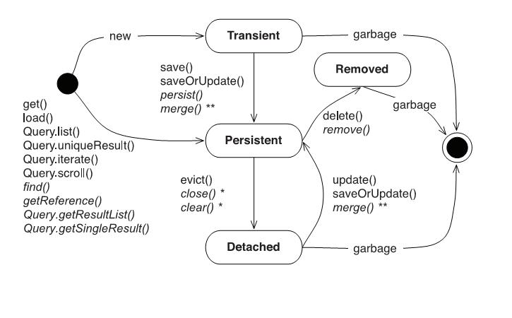

= JPA/Hibernate camp
:docInfo1
:numbered:
:icons: font
:pagenums:
:imagesdir: img
:iconsdir: ./icons
:stylesdir: ./styles
:scriptsdir: ./js

:image-link: https://pbs.twimg.com/profile_images/425289501980639233/tUWf7KiC.jpeg
ifndef::sourcedir[:sourcedir: ./src/main/java/]
ifndef::resourcedir[:resourcedir: ./src/main/resources/]
ifndef::imgsdir[:imgsdir: ./../img]
:source-highlighter: coderay

INFO
== info adoc

.Built-in
asciidoctor-version:: {asciidoctor-version}
safe-mode-name:: {safe-mode-name}
docdir:: {docdir}
docfile:: {docfile}
imagesdir:: {imagesdir}

.Custom
sourcedir:: {sourcedir}

== Topic

image::data_access_layers.svg[]

== Zasada działania

image::ORM-jdbc.jpg[]

**Zalety**

Standardowe podejście oparte na JDBC wymaga od programisty następujących czynności:
 
 - Opening a database connection
 - Maintaining an open connection
 - Building a query
 - Executing a query
 - Getting a response to the query
 - Mapping the query response with the custom classes
 - Closing the database connection

**Czyli ORM :**
[options=interactive]

*    redukuje znaczenie ilość kodu potrzebnego to stworzenia i wykonania zapytania 
*    redukuje koszt i czas deploymentu
*    redukcja boilerplate JDBC 
*    skupienie na problemach biznesowych 
*    mniej synchronizacji kodu z relacyjną bazą danych
*    zwiększa szybkość wytwarzania (produktywność - metaDane, query data)
*    dostarcza mechanizmy przenośności na inne bazy (nie musimy ograniczać się do danego typu bazy )  (portability)

**   **Dostępne dialekty :** 
   
***	 DB2Dialect (supports DB2)
***	 FrontBaseDialect
***	 HSQLDialect
***	 InformixDialect
***	 IngresDialect
***	 InterbaseDialect
***	 MySQLDialect
***	 Oracle8Dialect
***	 Oracle9Dialect
***	 Oracle10Dialect
***	 PointbaseDialect
***	 PostgreSQLDialect
***	 ProgressDialect
***	 SybaseDialect 
   
 
* idealnie nadaje się do protytypowania  
 
**Dodatkowo otwiera możliwości :** 

* reużywalności kodu
* zarządzania transakcjami
* wydajnego operowania na kolekcjach relacji
* wbudowany mechanizm cache'u
* wprowadza obiektowe techniki do świata relacyjnych baz danych
 
**Wady:**

* krzywa nauki 
* dodatkowy narzut na zapytania (overhead)
* w pewnych przypadkach powoduje spadek wydajności z stosunku do zwykłych zapytania JDBC
* wraz ze wzrostem złożoności modelu domenowego występują trudności z mapowaniem, wydajnością. Skutkuje to często wprowadzaniem 'haków' 
 
== Architektura

image::data_access_layers.svg[]

== Moduły
[square]
**Hibernate Core**

-  odpowiada za generowanie natywnych kwerent SQL
-  dostarcza dialekty 
-  dostarcza mechanizmy obsługi i translacji zapytań jak : HQL, Criteria Query czy QBE
-  odpowiada za buforowanie i efektywne pobieranie danych - czyli optymalizuje zapytania 
 
**Hibernate Annotation**

-  dostarcza znacziki metadanych równorzędne do konfiguracji mapować w XML

**Hibernate EntityManager**

- jest implementacją interfejsu JPA
 
**Hibernate Search**

-  dostarcza rozwiązań użycia indeksów Lucene
 
**Hibernate Validator**

-  obsługa walidacji danych
 
**Hibernate OGM**

-  rozwiazania NoSql
 
**DataSourcePool**
 
- hibernate-c3p0  Integrates the C3P0 connection pooling library into Hibernate 

[source,java]
----
<property name="hibernate.c3p0.min_size">5</property>
<property name="hibernate.c3p0.max_size">10</property>
<property name="hibernate.c3p0.timeout">300</property>
<property name="hibernate.c3p0.max_statements">50</property>
<property name="hibernate.c3p0.acquire_increment">1</property>
<property name="hibernate.c3p0.idle_test_period">3000</property>
 
Here’s an explanation for each of the parameters you set:
•	 min_size is the minimum number of connections that are ready at all times.
•	 max_size is the maximum number of connections in the pool. This is the only
property that is required for c3p0 to be enabled.
•	 timeout is the maximum idle time for a connection, after which the connection is
removed from the pool.
•	 max_statements is the maximum number of prepared statements that can be
cached.
•	 idle_test_period is the time in seconds before which a connection is automatically
validated.
•	 acquire_increment is the number of connections acquired when the pool is
exhausted.
----

- hibernate-hikaricp  Integrates the HikariCP connection pooling library into Hibernate
- hibernate-proxool   Integrates the Proxool connection pooling library into Hibernate
 
**Cache**

*hibernate-ehcache*  Integrates the Ehcache caching library into Hibernate as a second-level cache provider.
    
*hibernate-infinispan* Integrates the Infinispan caching library into Hibernate as a second-level cache provider.
 
 
 
   

* Problem on granularity

== Minimalna konfiguracja projektu :

== Hibernate
- [ ] Maven

[source, xml]
-----
   <dependencies>
		<dependency>
			<groupId>org.hibernate</groupId>
			<artifactId>hibernate-core</artifactId>
			<version>4.3.5.Final</version>
		</dependency>
	</dependencies>
-----
 
- [ ] Gradle
 
 * Konfiguracja bazy 
- [ ] maven

[source,xml]
----

<dependency>
    <groupId>com.h2database</groupId>
    <artifactId>h2</artifactId>
    <version>1.4.178</version>
</dependency>

----
**Możliwe typy konfiguracji :** 
  - konfiguracja bezpośrednio w kodzie
[source,java]
----

   Configuration configuration = new Configuration().addResource("Book.hbm.xml")
.setProperty("hibernate.dialect", "org.hibernate.dialect.DerbyTenSevenDialect")
.setProperty("hibernate.connection.driver_class", "org.apache.derby.jdbc.EmbeddedDriver")
.setProperty("hibernate.connection.url", "jdbc:derby://localhost:1527/BookDB")
.setProperty("hibernate.connection.username", "book")
.setProperty("hibernate.connection.password", "book");
 
ServiceRegistry serviceRegistry = new StandardServiceRegistryBuilder().applySettings(configuration.getProperties()).build();
sessionFactory = configuration.buildSessionFactory(serviceRegistry);

----
- konfiguracja xml 
- konfiguracja z użyciem plików properties
  
 
* Pojęcia
**  Encja
**  PersistenceUnit

[source,java]
----

@PersistenceUnit(unitName="pu-unit")
private EntityManagerFactory emf;

----

** PersistenceContext
  
[source,java]
----

@PersistenceContext (unitName = "pu-unit")
EntityManager entityManager;

----

== Terminy związane z Hibernate
- przezroczyste utrwalanie danych
- mapowania obiektów na tabele
- sprawdzanie zabrudzeń (dirty-checking) 
- przechodność utrwalania (transitive persistence)
- przechodność utrwalania (lazy loading/fetching)
- generowanie schematu danych 
- symulacja dziedziczenia modelu relacyjnego
 
  
== Nowości w JPA 2.1
Querying Stored Procedure

[source,java]
----

  @Test
    public void testCallStoreProcedure() {       
        StoredProcedureQuery query = em.createStoredProcedureQuery("my_sum");
        query.registerStoredProcedureParameter("x",Integer.class,ParameterMode.IN);
        query.registerStoredProcedureParameter("y",Integer.class,ParameterMode.IN);
        query.registerStoredProcedureParameter("sum",Integer.class,ParameterMode.OUT);
        
        query.setParameter("x", 5);
        query.setParameter("y", 4);
        query.execute();
        Integer sum = (Integer) query.getOutputParameterValue("sum");
        assertEquals(sum, new Integer(9));
    }
    
----

Attribute Converter
 
[source,java]
----

@Converter
public class PasswordConverter implements AttributeConverter<String, String> {
    @Override
    public String convertToDatabaseColumn(String arg0) {
        if(arg0!=null) {
            return Base64.getEncoder().encodeToString(arg0.getBytes());
        } else {
            return null;
        }
    }

    @Override
    public String convertToEntityAttribute(String arg0) {
        if(arg0!=null) {
            return new String(Base64.getDecoder().decode(arg0));
        } else {
            return null;
        }
    }
}

----
 
[source,java]
----

@Entity
public class Person {
    @Convert(converter=PasswordConverter.class)
    String password;
----
Constructor Result Mapping
 @ConstructorResult annotation is a handy addition to the already existing @SqlResultSetMapping and can be used to map the result of a query to a constructor call. 
[source,java]
----
@Entity
@NamedNativeQuery(name = "findWithTodoResultSetMapper", query = "SELECT id, description FROM TODO where description like ?1", resultSetMapping = "TodoResultSetMapper")
@SqlResultSetMapping(name = "TodoResultSetMapper", classes = @ConstructorResult(targetClass = org.hall.jpa.model.TodoPOJO.class, columns = {
		@ColumnResult(name = "id", type = Long.class),
		@ColumnResult(name = "description") }))
public class Todo {
	private Long id;
	private String summary;
	private String description;

	@Id
	@GeneratedValue(strategy = GenerationType.IDENTITY)
	
---- 

Programmatic Named Queries
addNamedQuery(String name, Query query) 
[source,java]
----

Query q = this.em.createQuery("SELECT a FROM Book b JOIN b.authors a WHERE b.title LIKE :title GROUP BY a");
this.em.getEntityManagerFactory().addNamedQuery("selectAuthorOfBook", q);

TypedQuery<Author> nq = this.em.createNamedQuery("selectAuthorOfBook", Author.class);
nq.setParameter("title", "%Java%");
List<Author> authors = nq.getResultList();

----

Named Entity Graph

Java 8 Date Time API
The Hibernate support for Java 8 Date Time API is provided in a separate module called hibernate-java8

* Connection pooling

Tworzenie  połączeń do bazy danych  jest kosztowne.
Hibernate dostarcza gotowe rozwiązanie do poolingu. Jednak rozwiązanie nie jest zalecane w produkcyjnym środowisku.
Zalecane w środowiskach produkcyjnych jest wykorzystanie zewnętrzych poll poprzez odwołania z JNDI lub konfigurowane zewnętrznie poprzez classpath czy odpowienie pliki properties.

Przykład zewnętrznej puli połączeń c3p0: 

[source,xml]
----
<dependencies>
   <dependency>
       <groupId>org.hibernate</groupId>
       <artifactId>hibernate-c3p0</artifactId>
       <version>[4.2.6,4.2.9)</version>
    </dependency>
  <dependency>
       <groupId>com.mchange</groupId>
       <artifactId>c3p0</artifactId>
       <version>[0.9.2.1,)</version>
  </dependency>
</dependencies>
----

Aby użyć powyższą konfigurację c3p0 wszystko co musimy zrobić to dodać wpis do konfiguracji hibernate: 
[source,xml]
----
<property name="c3p0.timeout">10</property>
----
W ten sposób Hibernate wyłączy wewnętrzną pulę połączeń i przestawi się na zewnętrzną.

* Inne rozwiązania to : 
   http://proxool.sourceforge.net/
   boneCp
   Apache poll connection
   hikarii
   Spring poll connection
   
   
== Cykl życia   

* Transient - obiekt istnie w pamięci i jest rozłączony od kontekstu Hibernate. Taki obiekt nie może być zarządzany przez Hibernate
  ** Tworzony za pomocą operatora new. Nie skojarzony z sesją.
   
   Utrwalenie:  save(), persist(), saveOrUpdate()
   save() i persist() -> Insert
   update() i merge() -> Update
   
* Persistence - obiekt istnieje w bazie danych. Obiekt jest zarządzany przez Hibernate czyli jest związany z sesją.
 
   Usunięcie : delete()
 
* Detached - obiekt ma reprezentacje w bazie danych, ale zmiana wartości obiektu nie ma wpływu na reprezentacje bazodanową i odwrotnie.

   Był trwały ale został odłączony od sesji.
   Możliwy do modyfikacji poza kontekstem.
   Przyłączenie do sesji jest możliwe
   
*  Removed - obiekty były zarządzane przez Hibernate, ale w wyniku operacji remove() zostały skasowane z bazy danych.

==Session Factory

- Służy do tworzenia obiektów Session (tworzenie, zarządzanie i pobieranie Session) 
- Jedna na kontekst (singleton pattern)
- thread-safe (immutable)
- ciężka i kosztowna do stworzenia
- konfigurowalna programowo lub poprzez konfiguracją xml
- współdzielony przez wiele wątków udostępniający egzemplarze Session

[source,java]
----

SessionFactory factory = configuration.buildSessionFactory(serviceRegistry);
//
SessionFactory factory = new AnnotationConfiguration().configure().buildSessionFactory();

----

[source,xml]
----
<hibernate-configuration>
<session-factory>
<!-- H2 Configuration -->
<property name="connection.driver_class">org.h2.Driver</property>
<property name="connection.url">jdbc:h2:file:./chapter1</property>
<property name="connection.username">sa</property>
<property name="connection.password"></property>
 
<property name="hibernate.dialect">org.hibernate.dialect.H2Dialect</property>
<property name="hibernate.show_sql">true</property>
<property name="hibernate.hbm2ddl.auto">create</property>
<mapping resource="Book.hbm.xml"/>
<mapping resource="Publisher.hbm.xml"/>
</session-factory>
</hibernate-configuration>
----
 

 
== Session 
-  'Unit of work'
-   Obsługuje transakcje
-   Lekka i szybka do stworzenia
-   można ją traktować jako fizyczne buforowalne połączenie z bazą danych
-   jedno wątkowy
-   krótki okres życia
-   zapewnia dostęp do podstawowych operacji CRUD  
 
    
Otwieranie nowej sesji : 
[source,java]
----
Session session = sessionFactory.openSession();
----

=== reuse an already created session

SessionFactory sessionFactory =
HibernateUtil.getSessionFactory();
Session session = sessionFactory.getCurrentSession();

It may seem easy to get the current session, but the twist here is that you have to provide
more configuration to the Configuration object if you plan to reuse the Session , as
shown in the following code:
<property name="hibernate.current_session_context_class">
Thread
</property>
In the preceding code, we set a thread value for the hibernate.current_session_
context_class key, meaning that the context of the current Session is limited to the life of
the current thread only.
For example, in a non-multithreaded environment, a Session is created when the main
thread is started. It will close automatically once the SessionFactory is closed.
This will help us more in a non-multithreaded environment because
it's faster than creating a new session each time.

=== Opening a stateless session
Basically, a stateless session is used to perform only one task. It does not take place in any
type of cache. A cache is used to store the frequently used objects in the current context.
There are some cases where a stateless session is very useful; for example, if we are reading
data from a file and inserting it into the database, we don't need to cache that data further
because this is a one-time operation.
Apart from this, a stateless session does not use dirty checking while performing a
transactional operation. The collections, as well as hibernate's event model and interceptors,
are ignored by a stateless session.

How to do it...
Now, let's look at how to create a stateless session. It's the same as creating a session, but
the method is different:
1.	 Enter the following code to open a stateless session:
SessionFactory sessionFactory =
HibernateUtil.getSessionFactory();
Session session = sessionFactory.openStatelessSession();

== Transaction 
-   abstrakcyjna warstwa obsługi transakcji bez względu na jej implementację (JDBC, JTA)

[source,java]
----

Company company = new Company(1, "Scalatech");
Transaction tx = session.beginTransaction();
session.save(company);
tx.commit();
session.flush();
session.close();

----

== Query, Criteria
- umożliwia dostęp do danych w bazie za pomocą wyspecjalizowanych zapytań czy API

 
== Tworzenie i zamykanie sesji

Otwieranie nowej sesji dla każdej transakcji bazowanowej jest dobrą praktyką (wielowątkowość)

SessionFactory sessionFactory =
HibernateUtil.getSessionFactory();
Session session = sessionFactory.getCurrentSession();
It may seem easy to get the current session, but the twist here is that you have to provide
more configuration to the Configuration object if you plan to reuse the Session , as
shown in the following code:
<property name="hibernate.current_session_context_class">
Thread
</property>

A Hibernate Session object represents a unit of work and is bound to the current thread. It also represents a
transaction in a database. A session begins when getCurrentSession() is first called on the current thread.
The Session object is then bound to the current thread. When the trans
[source,java]
----
Session session = factory.openSession();
try {
// Using the session to retrieve objects
}catch(Exception e)
{
e.printStackTrace();
} finally {
session.close();
}
----

== Transaction 
 - jedno wątkowy
 - określa granice jednej transakcji
 - 

== Opening a stateless session

== Tożsamość obiektu : Equals & hashcode
  - brak (Object) - (oparte na nie odłączanych encjach)
  - ID tożsamość bazodanowa
  - klucz biznesowy 
  - application managed id - (z bazy danych na aplikacje) (moment poczęcia lub urodzenia) 

== Object Equality and Identity

== Klucz główny
 klasa klucza głównego spełnia wymagania :
* public class
* klasa musi posiadać domyślny publiczny konstruktor
* musi implementować metody equals i hasCode
* musi być serializowalna
* klucz złożony musi być reprezentowany i mapowany do wielu pól właściwości klasy encji. Musi być też reprezentowany i mapowany jako klasa osadzona.     
   
== Relacje jedno i dwukierunkowe

* dwukierunkowa :
** obie encje posiadają wzajemnie do siebie relacje 
** strona przynależna związku dwukierunkowego musi odnosić się do swojego właściciela za poprzez użycie elementu **mappedBy** , należącego do adnotacji @OneToMany, @ManyToOne , lub @ManyToMany
** strona wielokrotna dwukierunkowego związku wiele do jednego nie może definiować **mappedBy** - jest zawsze 'posiadającą stroną relacji'
** w relacji jeden do jeden strona posiadająca pokazuje stronie przynależnej odpowiedni klucz obcy.
** w relacji wiele do wielu każda ze stron może być posiadająca.

* jednokierunkowe
 Tylko jedna strona posiada relację do innej encji   
   
== Kaskadowość 
* ALL (agreguje wszystkie poniższe)
* DETACH (jeśli encja macieżysta została odłączona od kontekstu wtedy również encja związna jest także odłączana)
* MERGE (jeśli encja macieżysta została przyłączona do kontekstu również encje powiązane zostaną przyłączone)
* PERSIST (jeśli encja macieżysta została utrwalona to samo stanie się z encjami przynależnymi)
* REFRESH (jeśli encja macieżysta została odświeżona w kontekście trwałości również encje powiązane zostaną odświeżone)
* REMOVE  (jeśli encja macieżysta została usunięta z kontekstu trwałości to również encje powiazane zostaną usunięte)

== Usuwanie sierot - orphanRemoval
There’s one more cascading operation that’s not part of the normal set, called orphan removal, which removes an
owned object from the database when it’s removed from its owning relationship.

[source,java]
----
@Test
public void orphanRemovalTest() {
Long id = createLibrary();
 
Session session = SessionUtil.getSession();
Transaction tx = session.beginTransaction();
 
Library library = (Library) session.load(Library.class, id);
assertEquals(library.getBooks().size(), 3);
 
library.getBooks().remove(0);
assertEquals(library.getBooks().size(), 2);
 
tx.commit();
session.close();
 
session = SessionUtil.getSession();
tx = session.beginTransaction();
 
Library l2 = (Library) session.load(Library.class, id);
assertEquals(l2.getBooks().size(), 2);
Query query = session.createQuery("from Book b");
List books = query.list();
assertEquals(books.size(), 2);
 
tx.commit();
session.close();
}

@Entity
public class Library {

@OneToMany(orphanRemoval = true, mappedBy = "library")
List<Book> books = new ArrayList<>();
}

@Entity
public class Book {

@ManyToOne
Library library;
}
----

   
== Pobieranie encji
* load()

Na podstawie danego Id metoda load próbuje pobrać obiekt z bazy danych. Jeśli obiekt nie istnieje wyrzucany jest wyjątek org.hibernate.ObjectNotFoundException
Metoda load() zwraca też proxy, oznacza to tyle, że nie nastąpi uderzenie do bazy danych do czasu kiedy faktycznie będziemy potrzebować danego obiektu.
Proxy zwraca dummy object zamiast uderzyć do db. Jeśli obiekt jest w first-level cache zwróci obiekt.
Jeśli obiektu nie ma w first-level-cache uderzy do bazy.

[source,java]
----
public Object load(Class theClass, Serializable id) throws HibernateException
public Object load(String entityName, Serializable id) throws HibernateException
public void load(Object object, Serializable id) throws HibernateException
----

* Lock

* NONE: Uses no row-level locking, and uses a cached object if available; this is the Hibernate default.
* READ: Prevents other SELECT queries from reading data that is in the middle of a transaction (and thus possibly invalid) until it is committed.
As usual, there’s more to this than we’re discussing here. We’ll add more methods to this list as we keep going through Hibernate’s
capabilities. We’re keeping the list small for simplicity’s sake.
* UPGRADE: Uses the SELECT FOR UPDATE SQL syntax to lock the data until the transaction is finished.
* UPGRADE_NOWAIT: Uses the NOWAIT keyword (for Oracle), which returns an error immediately if there is another thread using that row; otherwise this is similar to UPGRADE.
* FORCE: Similar to UPGRADE but increments the version for objects with automatic versioning when loaded.

[source,java]
----
public Object load(Class theClass, Serializable id, LockMode lockMode) throws HibernateException 
public Object load(String entityName, Serializable id, LockMode lockMode) throws HibernateException
----
 
 
 You should not use a load() method unless you are sure that the object exists. If you are not certain, then use
one of the get() methods. The load() methods will throw an exception if the unique ID is not found in the database,
whereas the get() methods will merely return a null reference.
 

* get()   

Na podstawie danego Id metoda get() próbuje pobrać obiekt z bazy danych. Jeśli obiekt nie istnieje zwraca null.
Metoda get() w przeciwieństwie do metody load() uderza do bazy bezpośrednio.
 
[source,java]
----
public Object get(Class clazz, Serializable id) throws HibernateException
public Object get(String entityName, Serializable id) throws HibernateException
public Object get(Class clazz, Serializable id, LockMode lockMode) throws HibernateException
public Object get(String entityName, Serializable id, LockMode lockMode) throws HibernateException
----

przykład : 
[source,java]
----
Book book = (Book) session.load(Book.class, isbn);

Book book = (Book) session.get(Book.class, isbn);
----

== SAVE/PERSIST

public Serializable save(Object object) throws HibernateException
 
public Serializable save(String entityName,Object object) throws HibernateException
 
Both save() methods take a transient object reference (which must not be null) as an argument
The save() methods all create a new org.hibernate.event.SaveOrUpdateEvent event.

== MERGE vs UPDATE

Merge Does Following

Merge has intelligence. It has lot of pre-checks before it go actual merge(if required)

    if Object is transient, It simply fires INSERT query makes object persistent(attached to session)
    if Object is detached, fires select query to check whether data modified or not if modified, fires UPDATE query otherwise just ignore merge task.

where as session.update

    throws exception if object is transient.
    if Object is detached, it simply fires UPDATE query irrespective of data changes to object.

session.merge is expensive than update

saveOrUpdate() .
This particular method is used to save or update records. Hibernate updates the records for a
given object if the identifier field is given. If an identifier is not given, then hibernate will insert
a new record.

== Zapytania
include::retrieve.adoc

== Usuwanie obiektów z bazy 

Poprzez wywołanie metody remove lub kaskadowej operacji remove
Jeśli metoda remove jest wywołana na encji odłączonej zostanie wygenerowany wyjątek IllegalArgumentException lub zatwierdzenie transakcji się nie powiedzie.
Dane fizycznie zostaną usunięte w momencie zakończenia transakcji lub wykonania metody flush()

If the record does not exist in the database, you will face the Exception in thread
"main" java.lang.IllegalArgumentException: attempt to create delete
event with null entity exception because get() returns the null object while you try
to delete that object.

However, if you use the following code to delete the record, you will face another type of error:
Employee employee = new Employee();
employee.setId(1);
session.delete(employee);
When the preceding code is executed, you will face the Exception in thread "main"
org.hibernate.StaleStateException: Batch update returned unexpected
row count from update [0]; actual row count: 0; expected: 1 " exception.
This is because we are trying to delete Employee#1 from the database (which does not
exist), and the employee object is also not null; so, it throws an error.

There are many cases where you may face an exception; for example, when you try to remove
a parent object that is referred to by the child object. In such cases, you will get a foreign
key constraint violated exception.

DELETE FROM employee WHERE id=1;
[source,java]
----
Book book = (Book) session.get(Book.class,new Long(1));
session.delete(book);
----
Metoda ta wyrzuci wyjątek jeśli obiekt o podanym identyfikatorze nie istnieje w bazie (java.lang.IllegalArgumentException)

If the record does not exist in the database, you will face the Exception in thread
"main" java.lang.IllegalArgumentException: attempt to create delete
event with null entity exception because get() returns the null object while you try
to delete that object.
However, if you use the following code to delete the record, you will face another type of error:
Employee employee = new Employee();
employee.setId(1);
session.delete(employee);
When the preceding code is executed, you will face the Exception in thread "main"
org.hibernate.StaleStateException: Batch update returned unexpected
row count from update [0]; actual row count: 0; expected: 1 " exception.
This is because we are trying to delete Employee#1 from the database (which does not
exist), and the employee object is also not null; so, it throws an error.

== Aktualizacja 
UPDATE book SET title='jpa book' WHERE id=2;

In the preceding section, we used the update() method for updating a particular
record. Apart from this method, hibernate will provide one more useful method called
saveOrUpdate() .
This particular method is used to save or update records. Hibernate updates the records for a
given object if the identifier field is given. If an identifier is not given, then hibernate will insert
a new record.

== Merge

Merge jest odwrotną operacją do operacji refresh()
Nadpisuje encje w bazie danych wartościami encji odłączonych.

Merging is performed when you desire to have a detached entity changed to persistent state again, with the detached
entity’s changes migrated to (or overriding) the database. The method signatures for the merge operations are:

Object merge(Object object)
 
Object merge(String entityName, Object object)
 
Merging is the inverse of refresh(), which overrides the detached entity’s values with the values from the
database

[source,java]
----

Session session = factory.openSession();
tx = session.beginTransaction();
Company company = (Company)session.get(Company.class, 1);
company.setName("Scalatech S.p z.o.o");
tx.commit();
session.flush();
session.close();

----

== Odświeżanie encji (Refreshing Entities)

Metoda reload odświeża wartości dla encji wartościami z bazy danych. (odwrotność do merge)

These methods will reload the properties of the object from the database, overwriting them; thus, as stated,
refresh() is the inverse of merge(). Merging overrides the database with the values held by the previously transient
object, and refresh() overrides the values in the transient object with the values in the database.

[source,java]
----
public void refresh(Object object)  throws HibernateException
 
public void refresh(Object object, LockMode lockMode)  throws HibernateException
----

* Hibernate
[source,java]
----
Object merge(Object object)
 
Object merge(String entityName, Object object)
----
[square]
* JPA
include::jpa.adoc

== Autoreferencja
* relacja jaka zachodzi pomiędzy polami relacji tej samej encji

[source,java]
----
@Entity
class Category{

@ManyToOne
private Category parent;

@OneToMany(mappedBy="parent")
private List<Category> child;

}

----

== Updating Entities
Hibernate automatically persists changes made to persistent objects into the database. 6 If a property changes on a
persistent object, the associated Hibernate session will queue the change for persistence to the database using SQL.
From a developer’s perspective, you do not have to do any work to store these changes, unless you would like to force
Hibernate to commit all of its changes in the queue. You can also determine whether the session is dirty and changes
need to be committed. When you commit a Hibernate transaction, Hibernate will take care of these details for you.

== Dziedziczenie
include::inheritence.adoc[]

== Trwałość przez osiągalność

Ma miejsce wtedy, gdy z obiektu trwałego jest referencja do
innego obiektu
wtedy ten inny obiekt realizuje trwałość przez osiągalność
Jest rekurencyjna
Zapewnia integralność więzów referencyjnych
graf obiektów można odtworzyć wczytując jego korzeń
Teoretycznie istnieje obiekt korzenia, z którego da przejść do
dowolnego innego obiektu trwałego
w szczególności nieosiągalne obiekty powinny być z bazy
usunięte (niewydajne)
Hibernate nie implementuje tego modelu

== Trwałość kaskadowa
Trwałość przechodnia w Hibernate
Trwałość kaskadowa
Model realizowany w Hibernate
Koncepcja podobna do trwałości przez osiągalność
Powiązania są odtwarzane na podstawie asocjacji
domyślnie, hibernate nie dokonuje analizy asocjacji
Kaskady zwykle używa się do relacji jeden-do-jednego i
jeden-do-wielu
używanie kaskady w przypadkach wiele-do-jednego i
wiele-do-wielu jest raczej bez sensu
Wartości kaskady można łączyć, np.
cascade="save-update, delete

== Criteria

== Transakcyjność
include::transactions.adoc[]

== Logowanie zdarzeń
[source,xml]
----
<property name="show_sql">true</property>
----

* Włączenie  Live Statistics
[source,xml]
----
<property name="hibernate.generate_statistics">true</property>
----

== Kaskadowość

include::cache.adoc[]

== Cache level One
Activated by default

Linked to the Hibernate session

Stores all entities that were used within a session

== Cache level two

Session independent entity store
Needs to be activated
persistence.xml or EntityManagerFactory
Transparent usage
PersistenceProvider doesn‘t need to provide it Not always portable

Cache configuration

Cache Retrieve Mode
How to read entities from the cache

Cache Store Mode
How to write entities to the cache

Concurrency Strategy
How to handle concurrent access

Stores query results for a query and its parameters

[„FROM Author WHERE id=?“, 1]     [1]

Stores only entity references or scalars

Always use together with 2nd Level Cache

Hibernate specific

Stores query result session independent

Needs to be activated
persistence.xml: hibernate.cache.use_query_cache = true

Activate caching for a specific query
org.hibernate.Query.setCacheable(true)
@NamedQuery(… hints = @QueryHint(name="org.hibernate.cacheable", value="true"))

== FetchType
* Lazy
* Eager
* Fetch all required entities with one query
 - Fetch Join
[source,java]
----
List<Author> authors = this.em.createQuery(
		"SELECT DISTINCT a FROM Author a JOIN FETCH a.books b", 
		Author.class).getResultList();
----

+ Relationships gets loaded in same query
- Requires a special query for each use case
- Creates cartesian product

		 
 - @NamedEntityGraph
 Declaratively defines a graph of entities which will be loaded
[source,java]
----
@NamedEntityGraph(
	name = "graph.AuthorBooksReviews", 

	attributeNodes = 
@NamedAttributeNode(value = "books")
)
----

Graph is query independent

 
 - EntityGraph

== Zapytania natywne  

SqlResultSetMapping

@SqlResultSetMapping(
	name		= "myResultMapping ",
	entities		= {@EntityResult(...), …},
	classes	= {@ConstructorResult (…), …},
	columns	= {@ColumnResult(…), …}
)

this.em.createNativeQuery(“Select …", "myResultMapping")

== Orphal Removal

== Walidacja

== Problemy wydajnościowe
include::performance.adoc[] 

* N+1
* Paginacja
* 

== Blokowanie

* Optymistyczne 
  OptimisticLockException
  
* Pesymistyczne  

== Rozwiązywanie problemów
=== A common mistake when designing entity models is to try to make all associations bidirectional

=== kłopoty z pamięcią

=== Problemy z wydajnością mechnika : 
 - sprawdź wygenerowane SQL
 - sprawdź execution plan 
 - sprawdź poprawność indeksów bazodanowych
 - próba optymalizacji zapytania
 - próba rozważenia zapytania natywnego
     - jpql wspiera tylko niektóre podzbiory features z bazy danych 
     - SQL dla danej bazy może być wysoce wyspecjalizowany

@Basic(lazy)      
Lazy attribute fetching: an attribute or single valued association is fetched when the instance variable is accessed.
 This approach requires buildtime bytecode instrumentation and is rarely necessary.
Emmanuel Bernard wrote  @Lob are lazy by default
@Lob
@Fetch(FetchMode.SELECT)
@Type(type="org.hibernate.type.PrimitiveByteArrayBlobType")
byte[] myBlob;

=== OutOfMemoryException
- czyszczenie cache
- flush dla kontekstu
- dla przetwarzania wsadowego : hibernate.jdbc.batch.size = 50
- wyłączenie cache drugiego poziomu hibernate.cache.use_second_level_cache = false

=== With Hibernate you can load your Entity classes as:
[source,java]
----
sessionFactory = new AnnotationConfiguration()
                    .addPackage("test.animals")
                    .addAnnotatedClass(Flight.class)
                    .addAnnotatedClass(Sky.class)
                    .addAnnotatedClass(Person.class)
                    .addAnnotatedClass(Dog.class);
----

Is there a way to do the same thing - programmatically loading your Entity classes - in a JPA 2.0 compliant way?

- NO !

== Dobre praktyki

 - zachowanie właściwych poziomów abstrakcji podczas modelowania relacji
 - unikanie jawnych opercji save() - wzorzec 'unit of work'
 - load vs get
  Lepiej na początku jest sprawdzić czy obiekt jest null czy nie jeśli chcemy użyć metody get(). (NullPointerException problem)

 -unikaj relacji dwukierunkowych
 - tight coupling
 - cykliczność
 - utrzymanie spójności (musimy pamiętać aby obsłużyć dwie strony relacji)
 - paginacja
 - DDD agregacja
 - unikaj merge 
 - unikaj obiektów odłączonych
 - pobieranie zbyt dużych ilości danych powoduje marnowanie pamięci w warstwie aplikacji
 - identyczność obiektów a ich tożsamość w bazie
  

== O mnie
* programista
* blog link:http://przewidywalna-java.blogspot.com[]
* image:{image-link} [role='img-circle']

http://undermineddeveloper.com/2013/09/11/hibernating/

